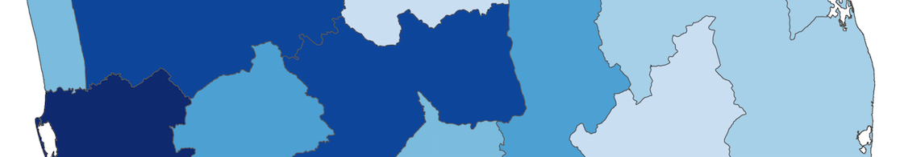

# pythonmap
### A guide to creating filled maps (or chloropleths) with Python

First, big thanks to Stephan Hügel for his excellent [guide to mapping with Python](http://sensitivecities.com/so-youd-like-to-make-a-map-using-python-EN.html#.VNZHhVXF8kR). 
To create this guide, I heavily borrowed from Stephan's work, but tried to provide more 
contextualizing comment to ensure that a less advanced user can create their own filled map.

For this guide, I focus on creating a filled map of Sri Lanka. I use some basic demographic data plus a shapefile that includes the first level of administration (for example, in the United States this is a state) to demonstrate how to create and manipulate a filled map with Python.

The shapefile I obtained is from the [Spatial Data Repository](http://spatialdata.dhsprogram.com/boundaries/#countryId=LK&view=map&surveyId=19&level=1) 
where you can find detailed shapefiles for most countries. 

## How this works
I highly recommend cloning this repository and using *SL Map.ipynb* to step through the guide as an iPython Notebook. If you're not familiar with iPython notebook or don't have it,
one of the easiest ways to get started is to download the [Anaconda](https://store.continuum.io/cshop/anaconda/) distribution of Python from Continuum Analytics.
To run iPython notebook open up a command line prompt and navigate to the directory that contains this repository. Then execute

	ipython notebook

Alternatively, you can go to my site where I have hosted a static version you can read through:
[brandonrose.org/pythonmap](http://www.brandonrose.org/pythonmap)

## Requirements
* pandas
* numpy
* matplotlib
* mpl_toolkits.basemap (Basemap)
* shapely
* pysal
* descartes
* fiona
* itertools

Up front, you are going to need to install some packages you might not have used before. I had to install pysal, descartes, shapely, and Basemap. Install **Basemap** with:

    pip install basemap --allow-external basemap --allow-unverified basemap
    
On Ubuntu I was able to install **Basemap** using:
	
	sudo apt-get install python-matplotlib
	sudo apt-get install python-mpltoolkits.basemap
    
If those options don't work you probably need to install **GDAL**. If you're on a Mac, go to the [kyngchaos site](http://www.kyngchaos.com/software/frameworks) and
use the GDAL 1.11 complete installer. 

If you're using Ubuntu, you should be able to install via:

	sudo apt-get install gdal-bin

If you're using Windows...good luck! Let me know if you're successful getting GDAL installed and if so how you managed it.

For installing **Fiona** you will probably need to install
	
	sudo apt-get install python-dev libxml2-dev libxslt-dev
	
and on Ubuntu potentially

	sudo apt-get install g++

## Questions?
Feel free to hit me up on github or on twitter @brandonmrose